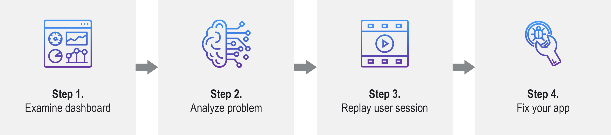
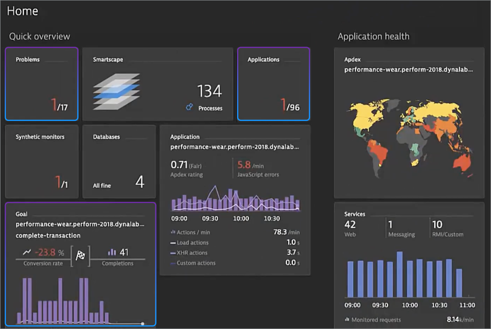
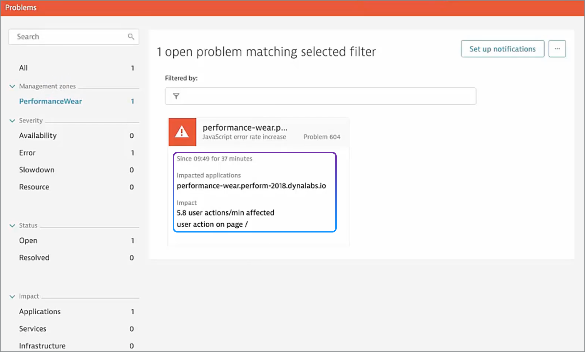
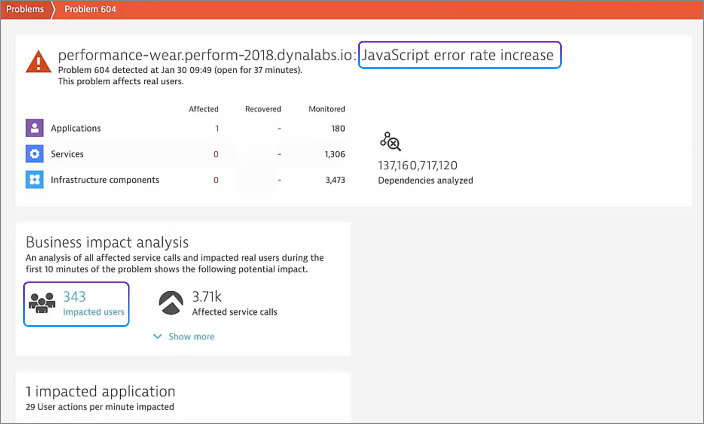
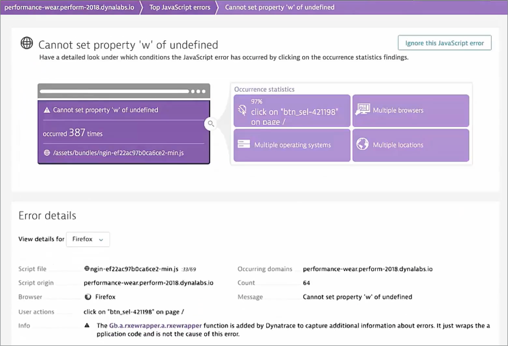
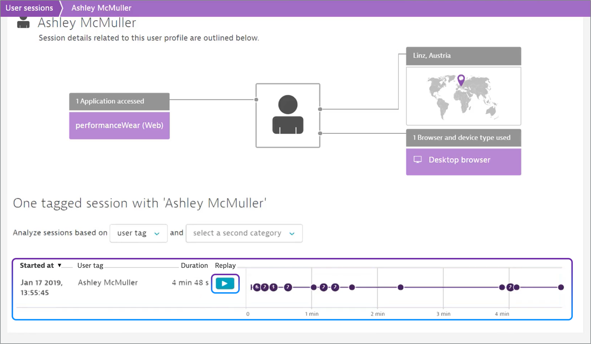
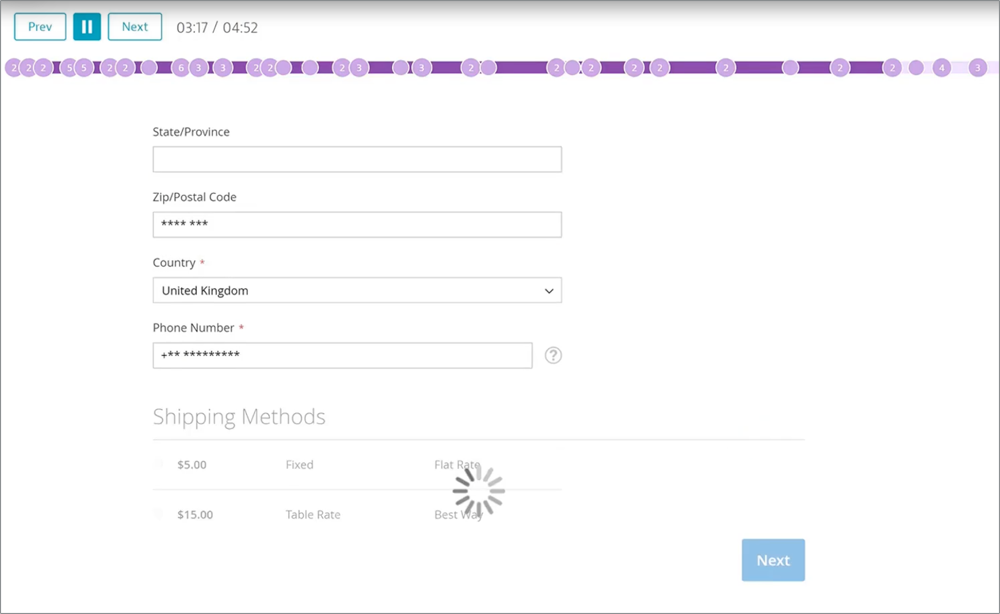

Real User Monitoring (RUM) can help you improve user interface, measure performance, or stay tuned for your website slowdowns. It may also come in handy when you need to troubleshoot your apps—and this tutorial will prove&nbsp;it.

Let’s take as an example an online shop PerformanceWear that sells clothing and accessories through a single-page web app. Ashley, their customer, calls the support team and states that she cannot buy anything at all as the website freezes once she enters her shipping address.

Follow the steps below to help Ashley complete her purchase.

## Step 1. Examine your dashboard

The first place to go when your clients are experiencing any issues is your [dashboard](https://www.dynatrace.com/support/help/how-to-use-dynatrace/dashboards-and-charts/).

Your dashboard is like a cockpit control panel that shows at a glance how your business is doing. With&nbsp;information-packed metrics, charts, and even maps, you can stay aware of your app health, anticipate issues, and respond faster to existing ones.

1. Navigate to the appropriate dashboard. It&nbsp;may be your favorite dashboard or the one that is dedicated to the app in trouble.
2. Carefully inspect each dashboard tile paying attention to metrics in red and unusual spikes on the charts. If&nbsp;you’ve spotted any of these warning signs, the well-being of your app is most likely affected.

Because the PerformanceWear app from our example is monitored by Dynatrace, a quick glance at their dashboard confirms that the app is really experiencing some issues. As you can see from the screenshot below, there is one open issue (**Problems** tile) and one app affected (**Applications** tile) as well as a sudden drop in conversion rates (**Goal** tile).

## Step 2. Analyze the problem

After you’ve grasped the summary of the situation from your dashboard, it’s time to drill down for more valuable information and analyze the problem.

1. From the dashboard, click the **Problems** tile. The [**Problems** feed](https://www.dynatrace.com/support/help/how-to-use-dynatrace/problem-detection-and-analysis/basic-concepts/view-the-history-of-open-closed-problems/) opens that contains a list of issues automatically found by [Davis](https://www.dynatrace.com/support/help/how-to-use-dynatrace/davis-assistant/), the Dynatrace AI engine.  
In the example below, the feed shows one problem detected at 9:49 am that’s already present for 37 minutes. The problem is within the PerformanceWear app and is affecting 5.8 user actions per minute.

2. From the **Problems** feed, select the required problem. The [problem overview page](https://www.dynatrace.com/support/help/how-to-use-dynatrace/problem-detection-and-analysis/basic-concepts/problem-overview-page/) opens providing even more details on the issue.  
In our example, the page shows that there are currently 343 users impacted by the issue, which is definitely caused by a JavaScript error.

3. Under **# Impacted application**, select the affected app. The application overview page shows&nbsp;up.
4. Scroll down to the **Top 10 JavaScript errors** section, and click the first error—the one that is occurring with the highest frequency.
5. Review the error overview page to identify a possible root cause of the issue. Pay attention to the occurrence statistics, error message, stack trace, and all other relevant information.

Unfortunately, as PerformanceWear is a single-page app, we simply don’t know from the error overview page where the actual command of `click on “btn_sel-421198”` happened or what it was meant to do within the context of the application. In this case, [Session Replay](https://www.dynatrace.com/support/help/how-to-use-dynatrace/real-user-monitoring/basic-concepts/session-replay/) may come to our rescue.

## Step 3. Replay the user session

With Session Replay, you can record and replay all user interactions within your app. It’s like watching a movie starring your app and your user—but even better. Session Replay helps you resolve customer complaints, improve user interface, and hunt application bugs.

1. Go back to the problem overview page.
2. Under **Business impact analysis**, click the **Impacted users** link. The **User sessions** page opens.
3. From the list of users, select the person who reported the issue with your app. The page opens providing the session details related to this user’s profile.
4. Next to the last user session—the one that allegedly contains the required evidence—click &nbsp;**Play**, and then click &nbsp;**Play** again.

5. Watch for the session replay to walk in your user’s shoes and see exactly when and where the problem occurred.

From the replay of Ashley’s user session, we’ve finally found out where the shoe pinches: after she entered the zip code in an invalid format, the app got frozen. Ashley tried to change the zip code and even returned to the home page to begin the check-out process again, but no success.

## Step 4. Fix your app

Now when you know what went wrong, it’s time to eliminate the problem that may have caused so much of your clients’ frustration. Whether it’s a broken HTML tag, outdated JavaScript code, or protocol issue, you now know where to start from.

Good luck and happy development!
